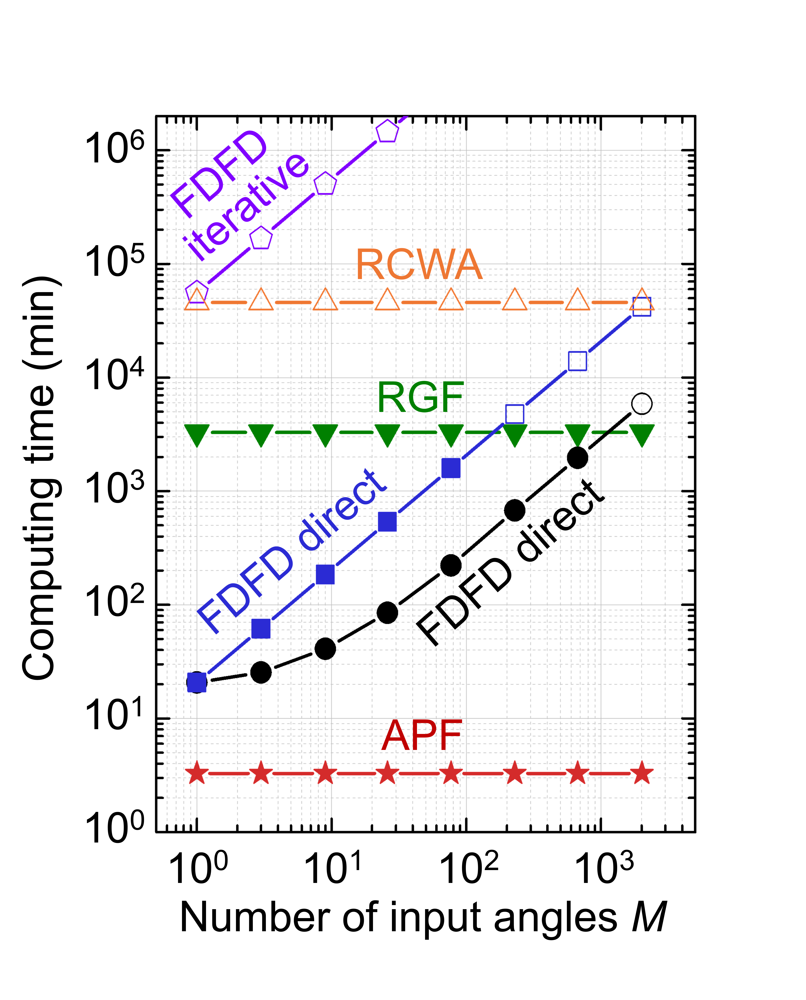
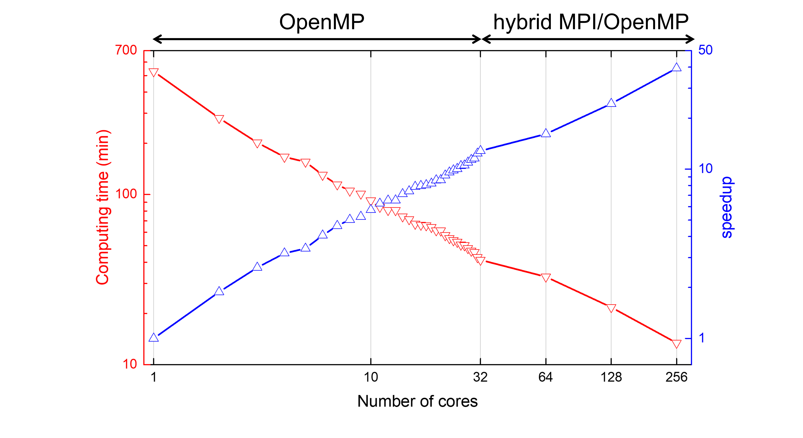

##  Parallelizing augmented partial factorization (APF) method to solve multi-input problems
 
### Problem description
Recently, a new method, [augmented partial factorization (APF)](https://arxiv.org/abs/2205.07887)[1], shows significant efficiency gain when we explore multi-input systems. However, now the APF method just utilizes the ''sequential'' [MUMPS solver](https://mumps-solver.org/index.php), and it constrains the system size we can explore, especially when we consider a fully 3D system. Therefore, we want to have our APF method utilize the ''parallel'' MUMPS solver and its parallelization feature, which enables us to simulate large multi-input systems that have never been studied before.
 
Actually, the parallel MUMPS solver is already there. The main work for this project is to extend the 2D formalism to 3D and implement the interface between our MESTI code and the parallel MUMPS solver, and test the parallalization performance. In our 3D MESTI code, we would use Julia language and call the MUMPS solver through MUMPS3.jl[2].

### Augmented partial factorization (APF)
Multi-source linear response of the system can be described in an M′ × M scattering matrix $\bf{S}$. Given any input
,written as a vector $\it{v}$, the relevant response (can be in any basis) written as a vector $\it{u}$ through
$$u_n = \sum_{m=1}^M S_{nm} v_m$$

 

 
Each column of ${\bf S}$ corresponds to one scattering problem, defined by ${\bf A} = - (\omega/c)^2 {\bar{\bar \varepsilon_{\rm{r}}}}  (\omega,{\bf{r}})$ $+ \nabla  \times {\bar{\bar \mu}}_{\rm{r}}^{-1} (\omega,{\bf{r}})\nabla  \times$ is the electric-field Maxwell operator, and column vectors $b_m$ and $x_m$ are the $m$-th source profile and the resulting vectorial electric field profile ${\bf E}({\bf r})$. Projecting the solution $x_m$ onto the outputs of interest yields the $m$-th column of ${\bf S}$, so the **S** can be written as
$${\bf{S}} = {\bf{C}}{{\bf{A}}^{ - 1}}{\bf{B}} - {\bf{D}}$$

The detailed expressions for the source-profiles matrix ${\bf{B}} = \left[ {{b_1}, \ldots,{b_M}} \right]$,
the projection-profiles matrix ${\bf{C}}$, and the baseline matrix ${\bf{D}}$ are given in Ref.[1].
Matrices ${\bf{A}}$, ${\bf{B}}$, ${\bf{C}}$, and ${\bf{D}}$ are all sparse. 

Conventional methods compute ${\bf X} = {\bf A}^{-1}{\bf B}$, which contains the solution on every element of the discretion basis (information that is not necessary) and requires a loop over the inputs. 
With APF, we bypass such computation; instead, we build an augmented matrix  ${\bf{K}}$ and perform a partial factorization on it,

$$\bf{K}=\begin{pmatrix}
\bf{A}&\bf{B}\\
\bf{C}&\bf{D}
\end{pmatrix}=\begin{pmatrix}
\bf{L}&\bf{0}\\
\bf{E}&\bf{I}
\end{pmatrix}\begin{pmatrix}
\bf{U}&\bf{F}\\
\bf{0}&\bf{H}
\end{pmatrix}$$

The partial factorization factorizes the upper-left block into ${\bf{A}} = {\bf{LU}}$, which we do not keep. Instead, we keep matrix ${\bf{H}} = {\bf{D}} - {\bf{C}}{\bf{A}}^{-1}{\bf{B}}$, schur complement of matrix ${\bf{K}}$, which yields the scattering matrix via ${\bf{S}} = -{\bf{H}}$. This method directly computes the entire ${\bf{S}}$, bypassing ${\bf X}$ and without looping over the inputs. We name this approach ''augmented partial factorization'' (APF).

 

The figure shows tha result from our open-source code [MESTI.m](https://github.com/complexphoton/MESTI.m)[3], which has implemented the APF method with a sequential solver to compute the Schur complement.

### Simulation methods and preliminary 3D results
We extend our APF formalism and theory to full 3D system[4]. Then we parallelize our APF method by calling the parallel MUMPS solver to do APF method to get the scattering matrix.
 
We compute the scattering matrix of a disordered medium, coupling 1,400 inputs and outputs.

 

The figure shows the APF computing time with pure OpenMP or hybrid MPI/OpenMP parallelism. We use pure OpenMP when the number of cores used fits within one node, and hybrid MPI/OpenMP with one MPI process per node when the number of cores is greater than 32. The hybrid MPI/OpenMP parallelization on 8 nodes reduces the computing time by a factor of 40.

Each computation is carried out on one Intel Xeon Gold 6130 node in USC Discovery cluster. 

### Reference
[1] H.-C. Lin, Z. Wang, and C. W. Hsu, ["Fast multi-source nanophotonic simulations using augmented partial factorization"](https://arxiv.org/abs/2205.07887), Nat. Comput. Sci. https://doi.org/10.1038/s43588-022-00370-6 (2022).

[2] W. Sweeney, MUMPS3.jl https://github.com/wrs28/MUMPS3.jl.

[3] H.-C. Lin, Z. Wang, and C. W. Hsu, MESTI.m. https://github.com/complexphoton/MESTI.m.

[4] H.-C. Lin, W. Zhang, and C. W. Hsu, "Fast multi-source nanophotonic simulations using augmented partial factorization", in preparation.
