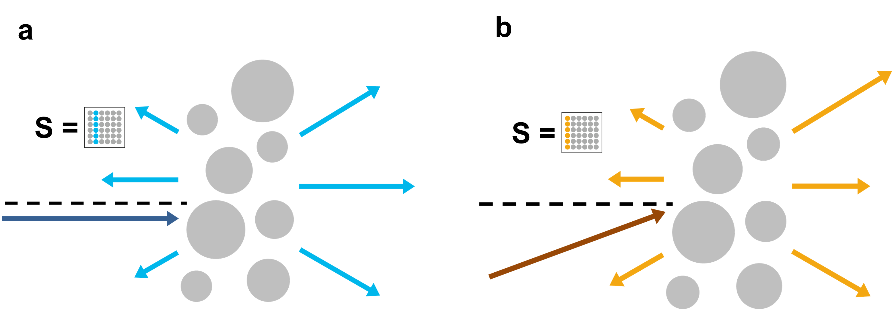

##  Parallelizing augmented partial factorization (APF) method to solve multi-input problems
 
### Problem description
Recently, a new method, [augmented partial factorization (APF)](https://arxiv.org/abs/2205.07887), shows significant efficiency gain when we explore multi-input systems. However, now the APF method just utilizes the ''sequential'' [MUMPS solver](https://mumps-solver.org/index.php), and it constrains the system size we can explore, especially when we consider a fully 3D system. Therefore, we want to have our APF method utilize the ''parallel'' MUMPS solver and its parallelization feature, which enables us to simulate large multi-input systems that have never been studied before.
 
Actually, the parallel MUMPS solver is already there. The main work for this project is to implement the interface between our MESTI code and the parallel MUMPS solver, and test the parallalization performance. In our 3D MESTI code, we would use JULIA language and call the MUMPS through MUMPS3.jl.

### Augmented partial factorization (APF)

### Simulation methods
We start from our open-source code [MESTI.m](https://github.com/complexphoton/MESTI.m), which has implemented the APF method with a sequential solver to compute the Schur complement. MESTI.m only deal with 2D system. We want to extend the formalism to full 3D system. Then we will parallelize our APF method by calling the parallel MUMPS solver to compute the Schur complement and get the scattering matrix
 
### Expected results
We will expect a significant speed up when we use the APF method with the parallel feature.
 
### Reference
[1] Ho-Chun Lin, Zeyu Wang, and Chia Wei Hsu, ["Fast multi-source nanophotonic simulations using augmented partial factorization"](https://arxiv.org/abs/2205.07887), Nat. Comput. Sci. https://doi.org/10.1038/s43588-022-00370-6 (2022).
 
[2] Ho-Chun Lin, Zeyu Wang, and Chia Wei Hsu, MESTI.m. https://github.com/complexphoton/MESTI.m.

[3] William Sweeney, MUMPS3.jl https://github.com/wrs28/MUMPS3.jl.
